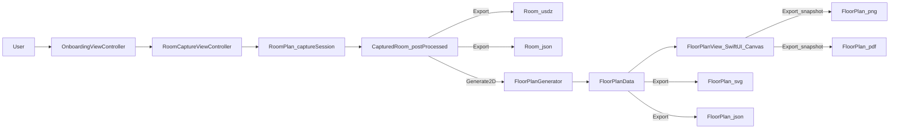

## Architecture overview

This repository has two main pieces:

- **iOS app**: captures a room with RoomPlan and exports results.
- **Export utilities**: Python scripts to inspect/convert the RoomPlan JSON output outside the app.

### High-level pipeline

### Separation of concerns

- **Capture + post-processing (RoomPlan)**:
  - Implemented in `RoomPlanExampleApp/RoomCaptureViewController.swift`.
  - Produces a `CapturedRoom` model and optionally exports it.

- **2D floor plan derivation**:
  - Implemented in `RoomPlanExampleApp/FloorPlanGenerator.swift`.
  - Converts from RoomPlan’s 3D coordinate system into a top-down 2D representation.

- **Rendering (SwiftUI)**:
  - Implemented in `RoomPlanExampleApp/FloorPlanView.swift`.
  - Focused on visualization and interaction (pan/zoom/toggles).

- **Export formats**:
  - Capture exports: `CapturedRoom.export(...)` (USDZ) + JSON encoding of `CapturedRoom`.
  - Floor plan exports: SVG (vector), PNG/PDF (rendered snapshots), and a simplified floor plan JSON schema (`FloorPlanExportData`).

### Coordinate system summary (critical)

- RoomPlan world axes:
  - **X** = right
  - **Y** = up (height)
  - **Z** = forward

- This repo’s 2D floor plan axes (top-down):
  - \(x = -worldX\)
  - \(y = worldZ\)

This convention is implemented in Swift (`FloorPlanGenerator.swift`) and mirrored in Python (`Export/conversionscript.py` and `Export/terminal_viewer/floorplan_viewer.py`).

