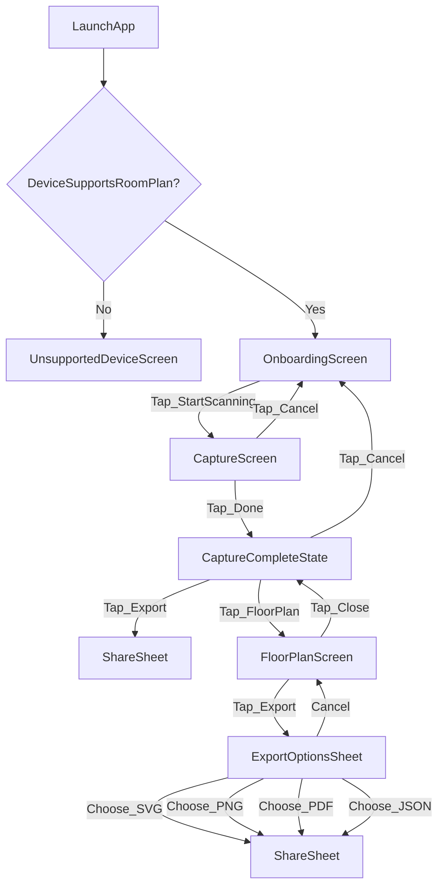
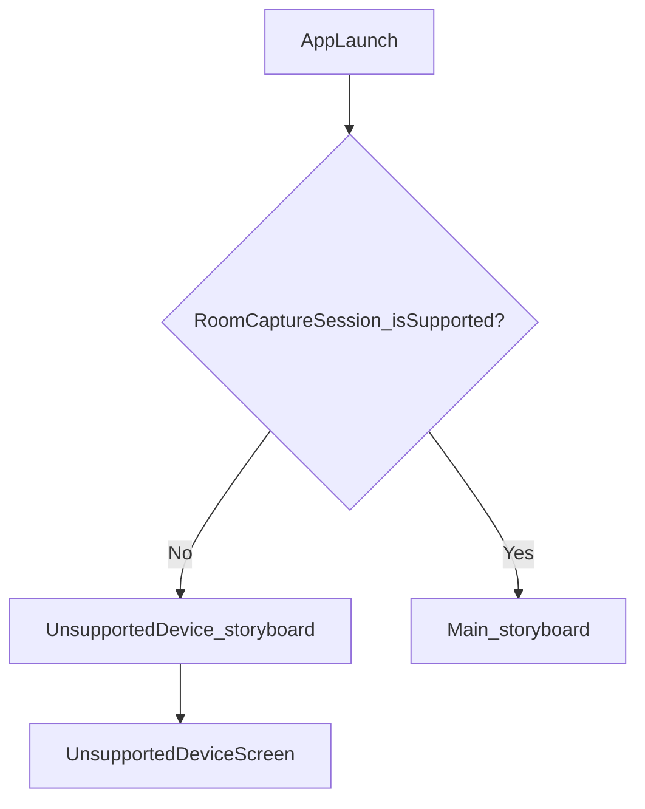
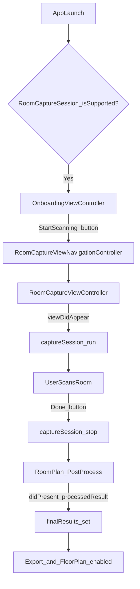
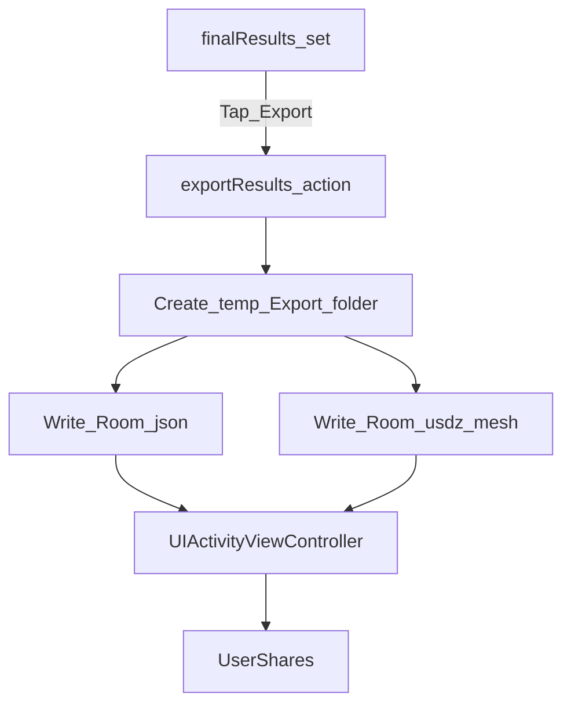
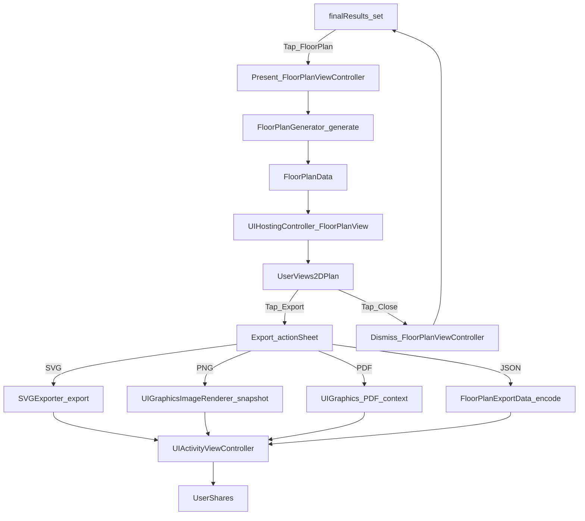

## Main user flows (mermaid)

These diagrams describe **what the user experiences** and which controller/actions implement each step.

### Screen map (only visible UI + user options)

Notes:
- `CaptureCompleteState` is the **same capture screen** after scanning stops and export buttons are shown/enabled.
- `ShareSheet` is `UIActivityViewController` (system UI).

### Unsupported device flow (no LiDAR / RoomPlan unsupported)

Implementation references:
- `RoomPlanExampleApp/AppDelegate.swift`
- `RoomPlanExampleApp/Base.lproj/UnsupportedDevice.storyboard`

### Happy path: onboarding → capture → results ready

Implementation references:
- `RoomPlanExampleApp/OnboardingViewController.swift`
- `RoomPlanExampleApp/Base.lproj/Main.storyboard`
- `RoomPlanExampleApp/RoomCaptureViewController.swift`

### Capture results export (USDZ + Room.json)

Implementation references:
- `RoomPlanExampleApp/RoomCaptureViewController.swift`

### Floor plan flow (view + export formats)

Implementation references:
- `RoomPlanExampleApp/RoomCaptureViewController.swift`
- `RoomPlanExampleApp/FloorPlanViewController.swift`
- `RoomPlanExampleApp/FloorPlanGenerator.swift`
- `RoomPlanExampleApp/FloorPlanView.swift`
- `RoomPlanExampleApp/SVGExporter.swift`

