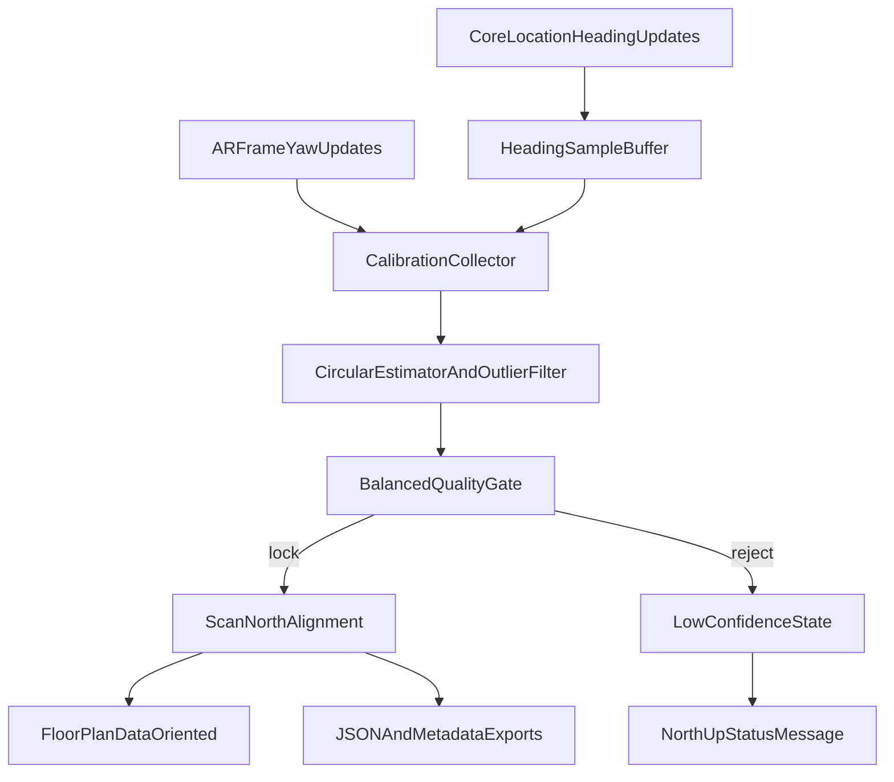

# North-Up Compass Alignment - Implementation Notes

## Goals
- Improve north-up repeatability by replacing single-shot calibration with robust multi-sample estimation.
- Keep behavior user-friendly with balanced confidence thresholds and clear UI state.
- Add manual recalibration without breaking save/export/reopen flows.

## Scope Implemented
- Core stability pipeline (buffered heading samples + robust estimator).
- Balanced quality gating and centralized confidence model.
- Confidence messaging in the floor-plan UI.
- Manual recalibration control while scanning.
- Backward-compatible persistence updates for alignment quality metadata.

## Key Files Updated
- `RoomPlanExampleApp/HeadingManager.swift`
- `RoomPlanExampleApp/RoomCaptureSwiftUIView.swift`
- `RoomPlanExampleApp/ScanHeading.swift`
- `RoomPlanExampleApp/FloorPlanScreen.swift`
- `RoomPlanExampleApp/FloorPlanView.swift`
- `RoomPlanExampleApp/FloorPlanExportData.swift`

## Implementation Details

### 1) Buffered heading pipeline
`HeadingManager` now stores a short in-memory heading history instead of relying only on the latest sample.

Added:
- `resetHistory()`
- `snapshotHeadings(near:maxAge:limit:)`
- `bestHeadingSample(near:maxAge:maxAccuracy:)`

Behavior:
- Prefers true-north samples over magnetic-north samples.
- Prefers better accuracy and closer timestamp proximity.
- Trims history by count and age to keep memory bounded.

### 2) Multi-sample calibration estimator
Calibration in `RoomCaptureSwiftUIView` was changed from single-shot lock to multi-sample lock.

New internal structures:
- `NorthCalibrationSample`
- `NorthCalibrationEstimate`
- `NorthCalibrationSettings`

Estimator logic:
1. Match each AR camera yaw with a nearby heading sample.
2. Compute angle delta per sample: `roomToNorthDelta = normalize(heading - cameraYaw)`.
3. Build candidate set within quality/timing window.
4. Compute circular mean (handles 0/360 wrapping).
5. Reject outliers by angular distance from initial mean.
6. Recompute circular mean on inliers.
7. Compute circular RMS spread and require spread threshold pass.
8. Compute representative (median) heading accuracy.
9. Lock `ScanNorthAlignment` only if all quality criteria pass.

### 3) Balanced quality gating
Balanced defaults were introduced for lock quality:
- tighter heading timestamp matching window than prior implementation,
- stricter lock-quality threshold than the old permissive reliability rule,
- sample-count and spread requirements before lock.

`ScanHeading` and `ScanNorthAlignment` now expose:
- `HeadingConfidenceState` (`high`, `medium`, `low`, `uncalibrated`)
- confidence-aware `isReliable`

`ScanNorthAlignment` now carries optional quality metadata:
- `sampleCount`
- `spreadDegrees`
- `confidence`

### 4) Confidence UX messaging
`FloorPlanScreen` now computes:
- `isNorthUpAvailable`
- `northUpStatusMessage`

`FloorPlanView` now renders `northUpStatusMessage` under view options:
- Shows lock status when available (for example, high/medium confidence).
- Shows explicit reason when north-up is disabled (for example, unstable heading or low accuracy).

### 5) Manual recalibration flow
Added a `Recalibrate` control during scanning.

Flow:
1. User triggers recalibration.
2. Alignment and sample window state reset.
3. Recalibration token increments in `RoomCaptureSwiftUIView`.
4. Token is passed through `RoomCaptureViewRepresentable`.
5. `RoomCaptureCoordinator` detects new token and re-enables calibration collection.

This allows relocking without restarting the entire scan session.

### 6) Persistence and compatibility
Export schema was updated with backward compatibility in mind:
- `FloorPlanExportData.version` set to `2.3`.
- Existing metadata fields remain:
  - `scanHeading`
  - `northAlignment`
  - `isNorthUpNormalized`
- New alignment quality fields are optional and decode-safe for older files.

No existing key names were removed or renamed.

## Data Flow (Implemented)

## Validation Performed
- Swift/IDE diagnostics checked for edited files: no linter issues.
- Simulator build validation executed successfully with:
  - `xcodebuild -project "RoomPlanExampleApp.xcodeproj" -scheme "RoomPlanExampleApp" -configuration Debug -destination "generic/platform=iOS Simulator" CODE_SIGNING_ALLOWED=NO build`

## Suggested Device Validation
1. Scan the same room multiple times from different starting poses.
2. Confirm north-up produces similar orientation across scans.
3. Save/reopen and verify orientation state is preserved correctly.
4. Test in a noisy/interference area and confirm north-up is disabled with a clear reason.
